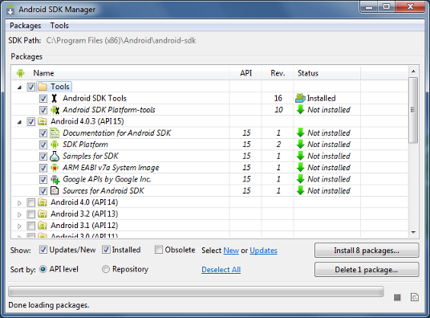

# cs56-android-getting-started
A CS56 project that describes how to get started with Android Programming in the context of CS56

##[Proceed to the Tutorial](/docs/tutorial/index.md)##

####[How was this tutorial built?](GitTutorialBuilding.md)####

####[pmsosa Legacy Code Project: SmokeSignals](https://github.com/pmsosa/SmokeSignals)####

<h1> Installing Android Studio </h1>
<h6>Last updated: osheaanaya | Summer 2016</h6>

- [Setting up Android Studio for Windows](#0_androidWindows)
- [Setting up Android Studio for Mac](#0_androidMac)
- [Setting up Android Studio for Linux](#0_androidLinux)
- [Sources](#0_sources)

---

<h2 id="0_androidWindows">Setting up Android Studio for Windows</h2>

***Note:* Android Studio is constantly reinventing itself and these steps could easily become deprecated in a near future so we highly recommend that you follow the latest instructions that are found at: https://developer.android.com/sdk/installing/index.html?pkg=studio**

- **Step 1: Install Latest Java JDK:** http://www.oracle.com/technetwork/java/javase/downloads/index.html
	- For Windows you must add java as an enviornment variable Select Start menu > Computer > System Properties > Advanced System Properties. Then open Advanced tab > Environment Variables and add a new system variable JAVA_HOME that points to your JDK folder, for example C:\Program Files\Java\jdk1.8.0_21.

- **Step 2: Download and Install Android Studio + (Android SDK & Emulators):** https://developer.android.com/studio/index.html
- To install Android Studios Proceed as follows:

1. Launch the .exe file you downloaded.
2. Follow the setup wizard to install Android Studio and any necessary SDK tools. 

- **Step 3: Adding any necessary SDK packages**
- By default, Android Studio will come with all the SDK packages that you need, but if for some reason you don't have them (e.g. You installed the standalone Android Studio). As a minimum when setting up the Android SDK, you should download the latest tools and Android platform:

   

- Go into Android Studio and choose **Tools > Android > SDK Manager**

1. Open the Tools directory and select:
	- **Android SDK Tools** 
	- **Android SDK Plataform-tools**
	- **Android SDK Build-tools** (highest vesrsion)
2. Open the first Android X.X folder (the latest version) and select:
	- **SDK Plataform**
	- System image for the emulator, such as **ARM EABI v7a System Image**
3. Open the Extras Folder and select:
	- **Google USB Driver** *(Super important for actual phone testing)*
	- **Android Support Library**
	- **Android Support Repository**
	- **Google Repository**
	- (Optional) **Intel x86 Emulator Accelerator** *(Makes the default emulator a bit more efficient and fast)*

<h2 id="0_androidMac">Setting up Android Studio for Mac</h2>

***Note:* Android Studio is constantly reinventing itself and these steps could easily become deprecated in a near future so we highly recommend that you follow the latest instructions that are found at: https://developer.android.com/sdk/installing/index.html?pkg=studio**

- **Step 1: Install Latest Java JDK:** http://www.oracle.com/technetwork/java/javase/downloads/index.html
	- There are, however, known stability issues in Android Studio on Mac when using JDK 1.8. Until these issues are resolved, you can improve stability by downgrading your JDK to an older version (but no lower than JDK 1.6)

- **Step 2: Download and Install Android Studio + (Android SDK & Emulators):** https://developer.android.com/studio/index.html
- To install Android Studios Proceed as follows:

1. Launch the Android Studio DMG file.
2. Drag and drop Android Studio into the Applications folder, then launch Android Studio.
3. Select whether you want to import previous Android Studio settings, then click OK
4. The Android Studio Setup Wizard guides you though the rest of the setup, which includes downloading Android SDK components that are required for development.

- **Step 3: Adding any necessary SDK packages**
- By default, Android Studio will come with all the SDK packages that you need, but if for some reason you don't have them (e.g. You installed the standalone Android Studio). As a minimum when setting up the Android SDK, you should download the latest tools and Android platform:

   

- Go into Android Studio and choose **Tools > Android > SDK Manager**

1. Open the Tools directory and select:
	- **Android SDK Tools** 
	- **Android SDK Plataform-tools**
	- **Android SDK Build-tools** (highest vesrsion)
2. Open the first Android X.X folder (the latest version) and select:
	- **SDK Plataform**
	- System image for the emulator, such as **ARM EABI v7a System Image**
3. Open the Extras Folder and select:
	- **Google USB Driver** *(Super important for actual phone testing)*
	- **Android Support Library**
	- **Android Support Repository**
	- **Google Repository**
	- (Optional) **Intel x86 Emulator Accelerator** *(Makes the default emulator a bit more efficient and fast)*

<h2 id="0_androidLinux">Setting up Android Studio for Linux</h2>

***Note:* Android Studio is constantly reinventing itself and these steps could easily become deprecated in a near future so we highly recommend that you follow the latest instructions that are found at: https://developer.android.com/sdk/installing/index.html?pkg=studio**

- **Step 1: Install Latest Java JDK:** http://www.oracle.com/technetwork/java/javase/downloads/index.html

- **Step 2: Download and Install Android Studio + (Android SDK & Emulators):** https://developer.android.com/studio/index.html
- To install Android Studios Proceed as follows:

1. Unpack the .zip file you downloaded to an appropriate location for your applications, such as within /usr/local/ for your user profile, or /opt/ for shared users. 
2. To launch Android Studio, open a terminal, navigate to the android-studio/bin/ directory, and execute studio.sh. 

***Tip:* Add android-studio/bin/ to your PATH environment variable so you can start Android Studio from any directory**

3. Select whether you want to import previous Android Studio settings or not, then click OK.
4. The Android Studio Setup Wizard guides you though the rest of the setup, which includes downloading Android SDK components that are required for development.

***Note:***
If you are running a 64-bit version of Ubuntu, you need to install some 32-bit libraries with the following command:
          
              sudo apt-get install lib32z1 lib32ncurses5 lib32bz2-1.0 lib32stdc++6

If you are running 64-bit Fedora, the command is:
         
             sudo yum install zlib.i686 ncurses-libs.i686 bzip2-libs.i686**

- **Step 3: Adding any necessary SDK packages**
- By default, Android Studio will come with all the SDK packages that you need, but if for some reason you don't have them (e.g. You installed the standalone Android Studio). As a minimum when setting up the Android SDK, you should download the latest tools and Android platform:

   

- Go into Android Studio and choose **Tools > Android > SDK Manager**

1. Open the Tools directory and select:
	- **Android SDK Tools** 
	- **Android SDK Plataform-tools**
	- **Android SDK Build-tools** (highest vesrsion)
2. Open the first Android X.X folder (the latest version) and select:
	- **SDK Plataform**
	- System image for the emulator, such as **ARM EABI v7a System Image**
3. Open the Extras Folder and select:
	- **Google USB Driver** *(Super important for actual phone testing)*
	- **Android Support Library**
	- **Android Support Repository**
	- **Google Repository**
	- (Optional) **Intel x86 Emulator Accelerator** *(Makes the default emulator a bit more efficient and fast)*

<h2 id="0_sources">Sources</h2>

- Android Studio Installation Guide: https://developer.android.com/sdk/installing/index.html?pkg=studio

-------

	
