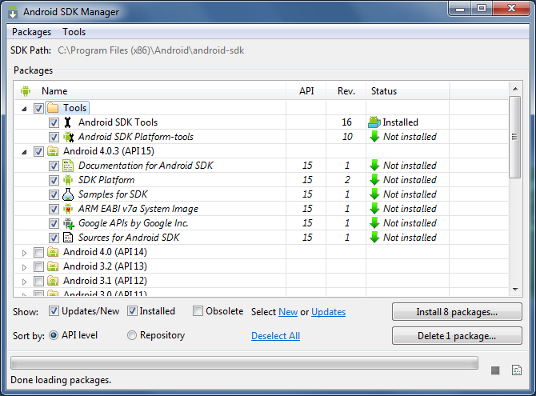
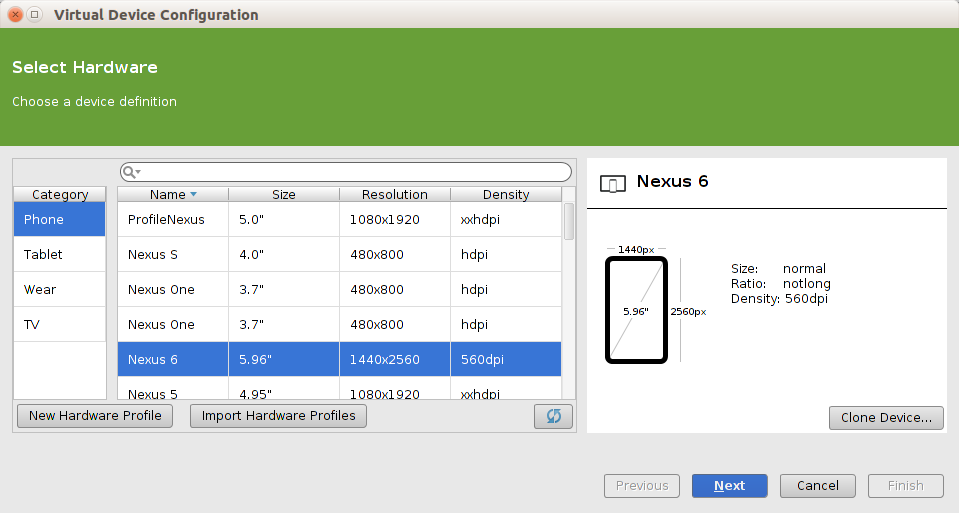

<h1>0. Installing Android Studio</h1>
<h6>Last updated: pmsosa | Winter 2015</h6>
######[Back to index](../index.md)######
<h2 id="0_index">Index</h2>

- [Setting up Android Studio](#0_androidStudio)
- [Setting up Android Emulation](#0_emulator)
	- Emulation Options
		- Default Emultor
		- Genymotion
	- AVD Manager
- [Setting up Android Phone for Testing](#0_phone)
- [SDK Manager](#0_sdkManager)
- [Sources & Further Reading](#0_sources)

---

<h2 id="0_androidStudio">Setting up Android Studio</h2>

<h3>Windows, Mac, & Linux</h3>

Android Studio is constantly reinventing itself, so rather than give you an in-depth explanation of how to install it (which could easily become deprecated in a near future), we will provide you with a basic idea of the things you need to install android studio.

***Note:* We highly recommend that you follow the latest instructions that are found at: https://developer.android.com/sdk/installing/index.html?pkg=studio**

- **Step 1: Install Latest Java JDK:** http://www.oracle.com/technetwork/java/javase/downloads/index.html
	- **Windows Only:** You must add java as an enviornment variable
		Select Start menu > Computer > System Properties > Advanced System Properties.
		Then open Advanced tab > Environment Variables and add a new system variable JAVA_HOME that points to your JDK folder, for example C:\Program Files\Java\jdk1.7.0_21.
		
- **Step 2: Download and Install Android Studio + (Android SDK & Emulators)**: https://developer.android.com/sdk/index.html

- **Step 3: Adding any necessary SDK packages**
By default, Android Studio will come with all the SDK packages that you need, but if for some reason you don't have them (e.g. You installed the standalone Android Studio). As a minimum when setting up the Android SDK, you should download the latest tools and Android platform:

Go into Android Studio and choose **Tools > Android > SDK Manager**

1. Open the Tools directory and select:
	- **Android SDK Tools** 
	- **Android SDK Plataform-tools**
	- **Android SDK Build-tools** (highest vesrsion)
2. Open the first Android X.X folder (the latest version) and select:
	- **SDK Plataform**
	- System image for the emulator, such as **ARM EABI v7a System Image**
3. Open the Extras Folder and select:
	- **Google USB Driver** *(Super important for actual phone testing)*
	- **Android Support Library**
	- **Android Support Repository**
	- **Google Repository**
	- (Optional) **Intel x86 Emulator Accelerator** *(Makes the default emulator a bit more efficient and fast)*
	

<h2 id="0_emulator">Setting up Emulators</h2>
<h3>Emulation Options</h3>
**Default Android Studio Emulators** Android studio provides the developer with integrated emulators. You have an emulated phone by default, but If you wish to have different device emulators you can add them with the ADV manager.

**GenyMotion** is an Android emulator that can be used with both Android Studio and Eclipse. It tends to be faster than the Android Studio emulators, and provides pretty much all the same functionality. You can refer to their website: https://www.genymotion.com for more information.
Installation instructions can be found at: https://www.genymotion.com/#!/download

<h3>AVD Manager</h3>
The AVD Manager allows you to manage and edit emulation devices (anything from phones, tv, wear, etc.)

It is a quite simple tool to use, however for more information please refer to: https://developer.android.com/tools/devices/managing-avds.html

To acces the AVD manager:  **Tools > Android> AVD Manager**

<h2 id="0_phone">Setting up Android Phone for Testing</h2>

To be able to test your application on your phone you must take the following steps:
1. On your android phone:
	- Go to **Settings > About Phone** and tap **Build number** seven (7) times. When you return to the main **Settings** menu you should find **Developer options** at the bottom.
	- On Developer Options:
		- Turn it **On**
		- Select **USB Debugging**
		- There are some other features that might come in handing depending on what you are programming, such as *Stay Awake*, *Allow Mock Locations*, *Pointer Location*, among others.
2. On your computer:
	- On Android Studio go to the SDK Manager (**Tools > Android > SDK Manager**) and Download the package (**Extras > Google USB Driver**)

- Troubleshooting
	- Try setting your phone USB computer connection as MTP. **Go to Settings > Storage > (The three little dots on the top-right corner) > USB computer connection** and **check MTP** (uncheck PTP)
	- Check to see if you actually have sufficient space on your phone. Android gets grumpy if it has very little (<100mb) memory free.
	- Sometimes compiling and loading an app onto a phone takes some time...just sayin'
	- Have you tried turning it on and off again?

More info: https://developer.android.com/tools/device.html

<h2 id="0_sdkManager">SDK Manager</h2>

The Android SDK separates tools, platforms, and other components into packages you can download using the SDK Manager. For example, when the SDK Tools are updated or a new version of the Android platform is released, you can use the SDK Manager to quickly download them to your environment.

You can acess the SDK Manager on Android Studio by going to **Tools > Android > SDK Manager.**
	
For more information feel free to visit: https://developer.android.com/tools/help/sdk-manager.html

<h2 id="0_sources">Sources & Further Reading</h2>

- Android Studio Installation Guide: https://developer.android.com/sdk/installing/index.html?pkg=studio
- Genymotion Emulator: https://www.genymotion.com
- Device Emulation: https://developer.android.com/tools/device.html
- ADK Manager: https://developer.android.com/tools/devices/managing-avds.html
- SDK Manager: https://developer.android.com/tools/help/sdk-manager.html

-------
######[Back to index](../index.md)######

<!--pmsosa CS56 Winter 2015-->
