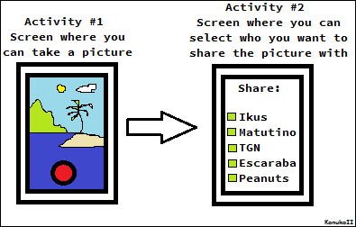
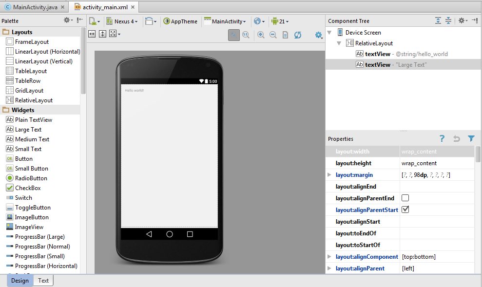

<h1>1. Basic Anatomy of an Activity</h1>
<h6>Last updated: pmsosa | Winter 2015</h6>
<h2 id="1_index">Index</h2>

- [Activities](#1_activities)
	- Definition
	- Lifecycle
- [Manifest](#1_manifest)
	- Definition
	- Example of a Basic Manifest File
	- Permissions
- [Layouts](#1_layouts)
	- Definition
	- Write XML
	- Read XML
- [Services](#1_services)
	- Definition
- [Sources & Further Reading](#1_sources)

---

<h2 id="1_activities">Activities</h2>
**Definition** 
In Android an Activity is an application component that provides a screen with which users can interact in order to do something, such as dial the phone, take a photo, send an email, or view a map. Activites can take up the full screen (e.g. Gmail app) or just parts of them and float on top of other windows (e.g. Facebook Messenger's chat bubbles).

It is important to note that a single app could have multiple activities.A single program can be composed of multiple 'activities' that provide different functionality and/or GUI. A simple example could be a photo sharing app:


**Activities Lifecycle**
Due to the nature of phone applications, Android Activities have a lifecycle that accounts for possible pauses where the user moves away from the application to interact with another. There are multiple callback methods that you should consider when building your application, but the two most important ones are usually going to be:

- **OnCreate()**
	You **must** implement this method. The system calls this when creating your activity.This is a great moment to load all the UI, graphics, etc. that you might need immediatly after the application starts running. (i.e. You just tapped on your icon's activity and it is now loading up to display.)
- **OnStart()**
	This is called when the user is leaving the application. You should take this oportunity to save any data that you don't want to be lost, as the user might or might not return to this application later (i.e. A user playing a game and briefly having to jump to check some walkthrough on the mobile's browser.)
	
Here is a more intuitive way of understanding the Activity's lifecycle:


For more info on the lifecycle and the callback methods, feel free to check the official [Android Development Website](https://developer.android.com/guide/components/activities.html#Lifecycle)

<h2 id="1_manifest">Manifest</h2>
**Definition**
Every application must have an **AndroidManifest.xml** file (with precisely that name) in its root directory. The manifest file presents essential information about your app to the Android system, information the system must have before it can run any of the app's code. There are a multitude of things that this manifest file is in charge of, however the most important ones that you should be aware of right now are:
- It **declares the permissions** the application must have in order to access protected parts of the API and interact with other applications.
- It **names the Java package** for the application. The package name serves as a unique identifier for the application.
- It **declares the minimum level of the Android API** that the application requires.
- It **describes the components of the application** — the activities, services, broadcast receivers, and content providers that the application is composed of. It names the classes that implement each of the components and publishes their capabilities (for example, which Intent messages they can handle). These declarations let the Android system know what the components are and under what conditions they can be launched. [This last one might seem a bit enigmatic, don't worry we will learn more about this once we jump into programming services and thing like that :P ]

**Example of a Basic Manifest File**

The first couple of lines simply describe that this file is indeed an XML file, and the package name for your application.
```XML
<?xml version="1.0" encoding="utf-8"?>
<manifest xmlns:android="http://schemas.android.com/apk/res/android"
    package="intro.android.cs56.ucsb.edu.helloworld" >
```
The next few lines could describe which permissions are needed for this app to run properly. (A super common mistake when programming on Android is to forget to declare which permissions your app needs, so keep an eye for that)
```XML
    <uses-permission android:name="android.permission.RECEIVE_SMS" />
    <uses-permission android:name="android.permission.SEND_SMS" />
    <uses-permission android:name="android.permission.READ_CONTACTS"/>
    <uses-permission android:name="android.permission.ACCESS_FINE_LOCATION"/>
```
Next we are registering our application, naming it, adding an icon,etc. 
Notice that within that application we are also declaring an activity. Within the activity definition we can see intent definitions. Intents are essentially describing under which conditions should the activity be executed. In this case the line of code : `<category android:name="android.intent.category.LAUNCHER" />` is declaring that this activity will be the "main" activity that will be shown when we first launch the app. 
```XML
    <application
        android:allowBackup="true"
        android:icon="@drawable/ic_launcher"
        android:label="@string/app_name"
        android:theme="@style/AppTheme" >
        <activity
            android:name=".MainActivity"
            android:label="@string/app_name" >
            <intent-filter>
                <action android:name="android.intent.action.MAIN" />

                <category android:name="android.intent.category.LAUNCHER" />
            </intent-filter>
        </activity>
    </application>

</manifest>
```

**Permissions**
You will most likely quickly run into situations where you want to access certain restricted parts of the API. When this happens feel free to check out the list of permissions at the official Android Developer page:
https://developer.android.com/reference/android/Manifest.permission.html


<h2 id="1_layouts">Layouts</h2>
**Definition**
A Layout defines the visual structure for a user interface. You can think of it as a blueprint of what UI you want painted on an activity (or an app widget).

**Writing a Layout XML**
- **Using Android Studio's UI Builder:** Android studio has a built in drag-and-drop interface for building these UI layouts. This is a great way to quickly prototype and build UIs, as you can see what you are doing real-time.


- **Coding:** Layout files are coded using typical XML syntax. More info can be found at: https://developer.android.com/guide/topics/resources/layout-resource.html

**Loading a Layout XML**
When you compile your application, each XML is compiled into a View resource (a class that paints a part of the screen). You should load your layout resource from your application code, in your Activity.onCreate() callback implementation.
```Java
public void onCreate(Bundle savedInstanceState) {
	super.onCreate(savedInstanceState);
	setContentView(R.layout.main_layout);
}
```
*Hint:* If you are thinking about having a dynamically changing content layout (aka. you want to jump from one UI to another) within the same activity. You might consider using: [ViewFlipper](https://developer.android.com/reference/android/widget/ViewFlipper.html). 

<h2 id="1_services">Services</h2>
**Definition**
A Service is an application component representing either an application's desire to perform a longer-running operation while not interacting with the user or to supply functionality for other applications to use. (e.g. When you use Google Music and the music keeps playing even though you traveled away from the application; or when you use Snapchat and even though you haven't opened the application you still get Stevie's annoying snaps....yes we get it Stevie, you are eating a delicious hamburger...sheesh!)


While not all applications will need to use services, it might be useful to know that they exist. We will study them more closely on [Chapter 3](todo)

<h2 id="1_sources">Sources & Further Reading</h2>
- Activities: https://developer.android.com/guide/components/activities.html
- Manifest: https://developer.android.com/guide/topics/manifest/manifest-intro.html
- Layouts: https://developer.android.com/guide/topics/ui/declaring-layout.html
- Services: https://developer.android.com/reference/android/app/Service.html

<!--pmsosa CS56 Winter 2015-->