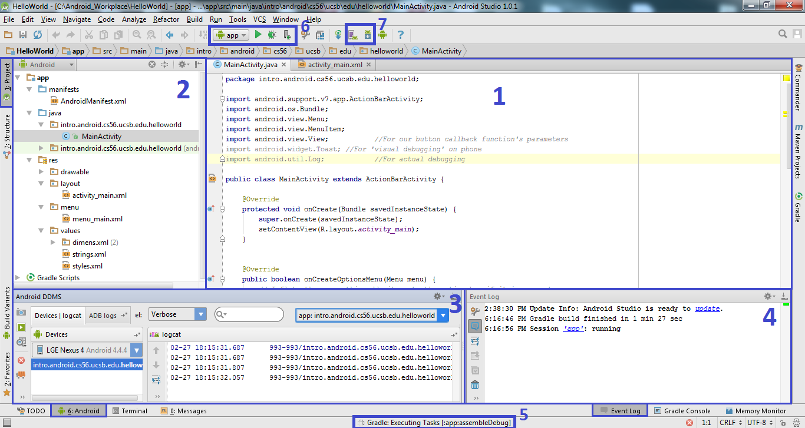
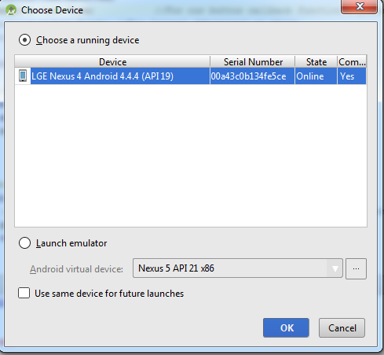
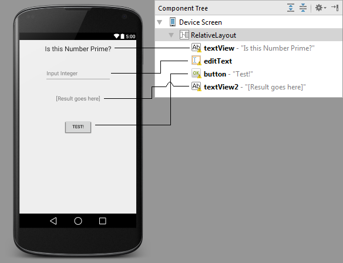

<h1>2. Building your first Android App</h1>
<h6>Last updated: pmsosa | Winter 2015</h6>
<h2 id="2_index">Index</h2>

- [Objective](#2_objective)
- [Starting a new project](#2_starting)
- [Using Android Studio](#2_usingAS)
- [Testing & Running](#2_testing)
- [Setting up a layout](#2_layout) 
- [Coding the App](#2_programming)
- [Final Code](#2_files)
- [Sources & Further Reading](#2_sources)

---

<h2 id="2_objective">Objective</h2>
The objective for this tutorial is to build and run a simple app that can determine weather or not a number is prime. We will touch on the basic principles of android development and GUI building, so that you can feel comfortable using Android Studio and coding for Android devices.

<h2 id="2_starting">Starting a New Project</h2>

-	**Creating the Project**
	- **Step 1:** Open Android Studio and select:
	 	- **Start a  new android Studio Project:** If you want to start from scratch 
	 	- *Note for future reference: If you wish to clone from GIT select: Checkout out project from Version Control*
	- **Step 2:** Specify the application name and package directory *(Note: if you decide to publish your app later on, your package name will become part of the web link to your app page on the play store)*
	- **Step 3:** On this next screen you are prompted to chose the minimum Android SDK required to run this app. **For the purposes of this tutorial choose whatever the whatever default Android SDK that is already selected.** *However note that,  Android is consistently changing and upgrading so depending on what you are doing or what your target audience is, you might need to consider this requirement more profoundly.*
	- **Step 4:** On this next screen you are given several Activity templates so that you can jump start your app quickly. You should definitely have a look around for fun but, for the time being just **choose the Blank Activity**
	- **Step 5:** Here you can specify the name of the activity and layout, **For the purposes of this tutorial just go with the default**

<h2 id="2_usingAS">Using Android Studio</h2>

Android Studio is based of [IntelliJ IDEA](https://www.jetbrains.com/idea/). It is an Integrated Development Studio (IDE) that essentially organizes together all the possible tools you will need while developing. It has integrated debugging, gradle (and maven) support, commandline execution, Android Device Debugging and bunch of other things that will make programming for Android a breeze. 

First let's look at the basic layout of Android Studio: *(Maybe you dont see panel 3 or 4, but don't worry we'll explain how to get them soon)*


- **(1) File editor:** As you can imagine, this is the place where you can edit your project files. *On top you can see different tabs for opened documents, and atop that you can see their location within the project.*
- **(2)Project Navigator:** Here you can explore the files within your project.*(Access Hotkey: ALT+1 or use the 1:Project)* 
- **(3) Android DDMS:** Here you can see debugging/log information from either your phone or emulator *(Access Hotkey: ALT+6 or use the 6:Android button)* 
- **(4) Event Log:** This panel shows an event log of things like compiling, running, or errors.*(Accessible by clicking on the Event Log button)*
- **(5) Background Tasks:** Shows you which tasks are happening right now (e.g compiling, uploading app to android phone/emulator, memory tracking, etc.)
- **(6) Run and Debug:** These are the main buttons for running & debugging.
- **(7) ADV and SDK:** These buttons bring up the ADK and SDK managers.


<h2 id="2_testing">Testing and Running</h2>

Congratulations! at this point you have a fully functional Android app that displays a simple activity with a "hello world!" label. Woot! At this point you should consider testing your app and make sure that everything works fine. You will probably be running and testing your app a bunch of times during the development of your app, so you want to make sure you know how to do this.

<h4>Running the app</h4>

First please make sure that you set-up Android Studio with either the necessary emulator or android device requirements (depending on what you are going to use)

Hit the **Run** button *(Hotkey: ALT+F10)*
Then choose either **A running device** *(android physical device)* or **Launch Emulator**.


Afterwards the program will compile and run on your chosen device.

<h4>Debugging with Android DDMS</h4>

Android ships with a debugging tool called the Dalvik Debug Monitor Server (DDMS), which provides port-forwarding services, screen capture on the device, thread and heap information on the device, logcat, process, and radio state information, incoming call and SMS spoofing, location data spoofing, and more.

While you can do a bunch of stuff with it, we are only going to show you how to do system print statements, so that you can debug your code just like you are used to.

In android, to do a print statement that appears in the DDMS console, you first need to `import android.util.Log` and then you can simply call:

```Java
//You can use tags to identify the source of the message (class or method)

Log.d("TAG","Some Message"); //d for Debugging
Log.e("TAG","Some Message"); //e for Error
Log.i("TAG","Some Message"); //i for info
Log.w("TAG","Some Message"); //w for warning
Log.wtf("TAG","Some Message"); //wtf for....."What a Terrible Failure"
```

Most likely though, you will simply end up using `Log.d(tag,message)` and its all good!

<h4>"Visual Debugging"</h4>

Although they aren't technically for debugging, you can use Toasts *(These are little messages that will pop on the actual screen)* for quick debugging. 

To use them first ```import android.widget.Toast``` and then you can call it by ```Toast toast = Toast.makeText(context, text, duration);```

In the case of this tutorial: *Context* is going to be the MainActivity so we can simply call: ```Toast.makeText(this,"Some Message!",Toast.LENGTH_LONG).show();```


<h2 id="2_layout">Setting up a Simple Layout</h2>

	
**Understanding the Layout Builder Screen**


- **(1) UI Preview Screen:** This is the main screen where you can drag-and-drop widgets and other GUI objects.
- **(2) Palette: ** From here you can select any widget or UI object and drop it into the Preview Screen. *(Hint: deprecated objects will show up striked-out)*
- **(3) Component Tree:** Shows the different UI objects and hierarchy among them.
- **(4) Properties:** Once you select a UI object from the layout *(either by clicking on it on the Preview screen or the Component Tree)* you can change it's properties.
- **(5) Design/Text Tabs:** You can quickly change from the GUI previewer to the the actual code with these tabs.

**Building the basic Layout for our Project**
Start by drag-and-dropping:
- **1 Large Text :** We are going to make this a simple title explaining the app's purpose in life.
- **1 Text Field (Number):** The field were we are going to judge the number to be a worthy prime or simply a regular composite number. Note: The nice thing about choosing the text field to be of type (Number) is that it restricts what the user can put into it by only providing a numerical keyboard when the user trys to input anything.
- **1 Button:** The button we are going to click to decide the fate of the number we want to test
- **1 Medium Text:** Where we are going to output the final decision, a strong "Yay!" if it's prime or a "Nay!" if it is not prime.

Feel free to put them in any particular place that you want. Overall it will look something like:


<h2 id="2_programming">Coding the App</h2>

<h4>Importing the necessary libraries</h4>

So before we start, the libraries you will need to import are:
*(Put this on top of your MainActivity java class)*
```Java
import android.view.View;	//For our button callback function's parameters
import android.widget.Toast; //For 'visual debugging' on phone
import android.util.Log; //For actual debugging
```

<h4>Renaming the UI objects</h4>

Each object in our UI layout has a set of properties. This properties describe the element's behavior and look. There are two ways of changing an elements properties.

- Declare the property in the XML (This is a good way of setting default properties or properties that you know will not be changed, such as a button text.)
	- With Android's UI designer you can simply select a UI object and change it's properties on the **Properties** panel.
	- *Pro Tip: double clicking on a UI object will allow you to quickly change its ID or Name*
	
	Changing the text of a button (wether you do it on the UI editor or directly with code) will end up looking like:
	
	```Java
	<Button
        android:layout_width="wrap_content"
        android:layout_height="wrap_content"
        android:id="@+id/button"
        android:layout_centerVertical="true"
        android:layout_centerHorizontal="true"
        android:text="Click Me!"	//<--- What the button will display as text
        android:nestedScrollingEnabled="false"/>
    ```
- Change it during runtime with code in your Activity. (This is similar to what you do when building UIs with the Java AWT or Swing Libraries.)
	This would look like:
	```Java
	Button btn = (Button) findViewById(R.id.button); // First Find it in the Layout
	btn.setText("Click Me!");
	```

Knowing this, feel free to change the UI elements to display them the way you want. Otherwise we suggest using the previous photo as reference.
- **Note:** that for the **Text Fields** there is a property called **Hint** which is the shaded text that disappears as soon as the user starts to input something into the field. This is completely different from **Text**.

<h4>Adding a callback function for our button</h4>
First thing we need to do is code our button so that when it gets clicked we call a function. For this we will need to change the button's **'onClick'** property. 

Now that you know how to change an UI object's properties you can choose to declare the button callback function however you want.

- **Option 1:** Declare it on the Layout XML
	- So wherever you have your button declared, you would just add `android:onClick="test_prime"`. 
	- Meanwhile  on the mainActivity *(or whatever activity is actually showing implementing this Layout)* we will code a testPrime function `public void test_prime(View view){/*Do something*/;}`
	Button Callback test_prime **must** functions have to be **public void** that take a **View** parameter.

- **Option 2:** Declare it directly on the code (at the MainActivity class)
	```Java
	Button btn = (Button) findViewById(R.id.button);
	btn.setOnClickListener(new View.OnClickListener() {
	    public void test_prime(View v) {
	    	// Do something
	    }
	});	
	```
	
<h4>Coding the 'test_prime' function</h4>

Using the previous concepts and ideas we can quickly build a simple function that not only tests for primes but also The following is going to be the test_prime function.

Most of the code is pretty self explanatory, notice that the main thing when working with UI elements is to first find them using something similar to: `Button btn = (Button) findViewById(R.id.button);` and then using methods `btn.foo(x,y,z)`.

Each UI element has multiple different method types. You can find out the specifics for each one at the [Android Developer Site](https://developer.android.com/guide/topics/ui/index.html)


```Java
//Button Callback Function//
public void test_prime(View view){

    //1. GET INPUT
    TextView textView = (TextView) findViewById(R.id.editText); //Obtain the TextView element where the user provides the input
    String str = textView.getText().toString(); //Get the text currently assigned to this input. (Since it is of inputType number we are assured that there will only be pos ints)

    //2. TEST INPUT
    if (!str.isEmpty()) { //Check that there is input
        Log.d("test_prime","Testing number"+str);
        int i = Integer.parseInt(str); //Turn the string into an int.

        //2.1 TEST PRIMENESS
        boolean prime = isPrime(i);

        //2.2 REPORT THE RESULT
        TextView textView2 = (TextView) findViewById(R.id.textView2);

        if (prime) {textView2.setText(i + " is a prime");}
        else { textView2.setText(i + " is not a prime");}

        Log.d("test_prime",i+" -> prime:"+(boolean)prime);

    } else{//The user could have pressed the button without providing any number.
        Log.d("test_prime","No number was provided");
        Toast.makeText(this,"No number provided",Toast.LENGTH_LONG).show();
    }
}
```
As for the isPrime() function we have a simple algorithm to figure out primeness.
```Java
//Tests if a number is prime//
private boolean isPrime(int i){
    boolean flag = true; //All inputs are considered prime until proven composite

    if (i < 2){ flag = false;} //0,1 are not primes
    else if (i == 2){ flag = true;} //2 is the only even prime
    else if ((i%2)==0){flag = false;} //Other multiple of 2 are not primes
    else {  //Odd numbers, we must check by bruteforce.
        for (int k = 3; k < Math.sqrt(i); k=k+2) {
            if (i%k==0){ flag = false;}    //if i is a multiple of some k number, then it is not a prime
        }
    }
    return flag;
}
```

That's all there really is to it. You just built a simple program that can help people figure out whether a number is prime or not. Wee! Now it is time for you to venture into more complex projects.

<h2 id="2_files">Final Code</h2>

Here are the complete manifest and class files for this project.
You can find the complete project [here](HelloWorld).

<h5>MainActivity.java</h5>

```Java
package intro.android.cs56.ucsb.edu.helloworld;

import android.support.v7.app.ActionBarActivity;
import android.os.Bundle;
import android.view.Menu;
import android.view.MenuItem;
import android.view.View;	        //For our button callback function's parameters
import android.widget.TextView;     //For accessing our textViews
import android.widget.Toast; //For 'visual debugging' on phone
import android.util.Log;            //For actual debugging

public class MainActivity extends ActionBarActivity {

    @Override   //You MUST implement this
    protected void onCreate(Bundle savedInstanceState) {
        super.onCreate(savedInstanceState);
        setContentView(R.layout.activity_main);
    }


    @Override   //You MUST implement this
    public boolean onCreateOptionsMenu(Menu menu) {
        // Inflate the menu; this adds items to the action bar if it is present.
        getMenuInflater().inflate(R.menu.menu_main, menu);
        return true;
    }

    @Override   //You MUST implement this
    public boolean onOptionsItemSelected(MenuItem item) {
        // Handle action bar item clicks here. The action bar will
        // automatically handle clicks on the Home/Up button, so long
        // as you specify a parent activity in AndroidManifest.xml.
        int id = item.getItemId();

        //noinspection SimplifiableIfStatement
        if (id == R.id.action_settings) {
            return true;
        }

        return super.onOptionsItemSelected(item);
    }

    //Button Callback Function
    public void test_prime(View view){

        //1. GET INPUT
        TextView textView = (TextView) findViewById(R.id.editText); //Obtain the TextView element where the user provides the input
        String str = textView.getText().toString(); //Get the text currently assigned to this input. (Since it is of inputType number we are assured that there will only be pos ints)

        //2. TEST INPUT
        if (!str.isEmpty()) { //Check that there is input
            Log.d("test_prime","Testing number"+str);
            int i = Integer.parseInt(str); //Turn the string into an int.

            //2.1 TEST PRIMENESS
            boolean prime = isPrime(i);

            //2.2 REPORT THE RESULT
            TextView textView2 = (TextView) findViewById(R.id.textView2);

            if (prime) {textView2.setText(i + " is a prime");}
            else { textView2.setText(i + " is not a prime");}

            Log.d("test_prime",i+" -> prime:"+(boolean)prime);

        } else{//The user could have pressed the button without providing any number.
            Log.d("test_prime","No number was provided");
            Toast.makeText(this,"No number provided",Toast.LENGTH_LONG).show();
        }
    }

    //Tests if a number is prime
    private boolean isPrime(int i){
        boolean flag = true; //All inputs are considered prime until proven composite

        if (i < 2){ flag = false;} //0,1 are not primes
        else if (i == 2){ flag = true;} //2 is the only even prime
        else if ((i%2)==0){flag = false;} //Other multiple of 2 are not primes
        else {  //Odd numbers, we must check by bruteforce.
            for (int k = 3; k < Math.sqrt(i); k=k+2) {
                if (i%k==0){ flag = false;}    //if i is a multiple of some odd number; not a prime
            }
        }
        return flag;
    }
}

```
<h5>Manifest</h5>

```XML
<RelativeLayout xmlns:android="http://schemas.android.com/apk/res/android"
    xmlns:tools="http://schemas.android.com/tools" android:layout_width="match_parent"
    android:layout_height="match_parent" android:paddingLeft="@dimen/activity_horizontal_margin"
    android:paddingRight="@dimen/activity_horizontal_margin"
    android:paddingTop="@dimen/activity_vertical_margin"
    android:paddingBottom="@dimen/activity_vertical_margin" tools:context=".MainActivity">

    <TextView
        android:layout_width="wrap_content"
        android:layout_height="wrap_content"
        android:textAppearance="?android:attr/textAppearanceLarge"
        android:text="Is this Number Prime?"
        android:id="@+id/textView"
        android:layout_centerHorizontal="true" />

    <EditText
        android:layout_width="wrap_content"
        android:layout_height="wrap_content"
        android:inputType="number"
        android:ems="10"
        android:id="@+id/editText"
        android:layout_below="@+id/textView"
        android:layout_centerHorizontal="true"
        android:layout_marginTop="52dp"
        android:hint="Input Integer" />

    <Button
        android:layout_width="wrap_content"
        android:layout_height="wrap_content"
        android:id="@+id/button"
        android:layout_centerVertical="true"
        android:layout_centerHorizontal="true"
        android:text="Test!"
        android:nestedScrollingEnabled="false"
        android:onClick="test_prime" />

    <TextView
        android:layout_width="wrap_content"
        android:layout_height="wrap_content"
        android:textAppearance="?android:attr/textAppearanceMedium"
        android:id="@+id/textView2"
        android:layout_below="@+id/editText"
        android:layout_centerHorizontal="true"
        android:layout_marginTop="48dp"
        android:text="[Result goes here]" />

</RelativeLayout>

```

<h2 id="2_sources">Sources & Further Reading</h2>
- Android Studio Tips and Tricks: https://developer.android.com/sdk/installing/studio-tips.html
- Android Input Controls: https://developer.android.com/guide/topics/ui/controls.html 
- Android Interface Tutorial: https://developer.android.com/training/basics/firstapp/building-ui.html
- Tuts+ Android GUI Tutorial: http://code.tutsplus.com/tutorials/android-sdk-user-interface-design--mobile-20323


<!--pmsosa CS56 Winter 2015-->


