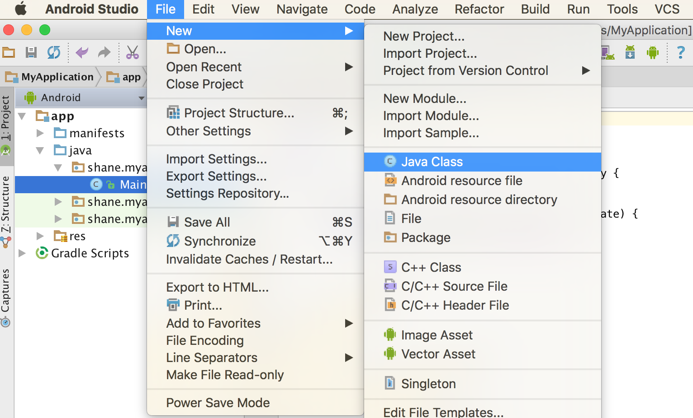
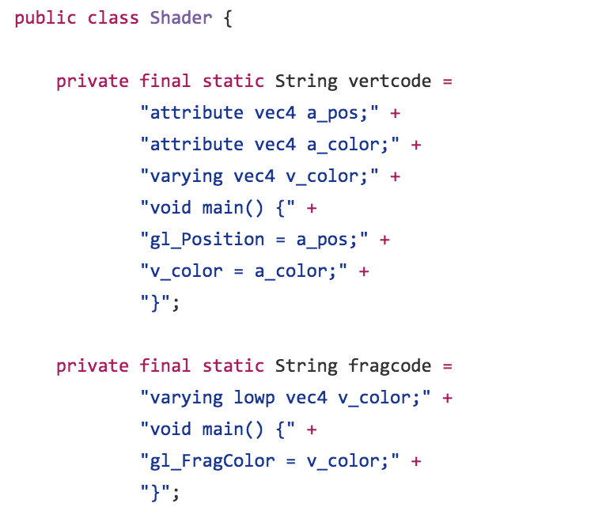
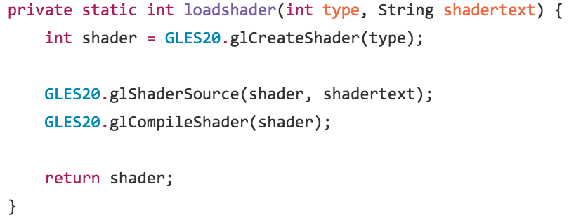
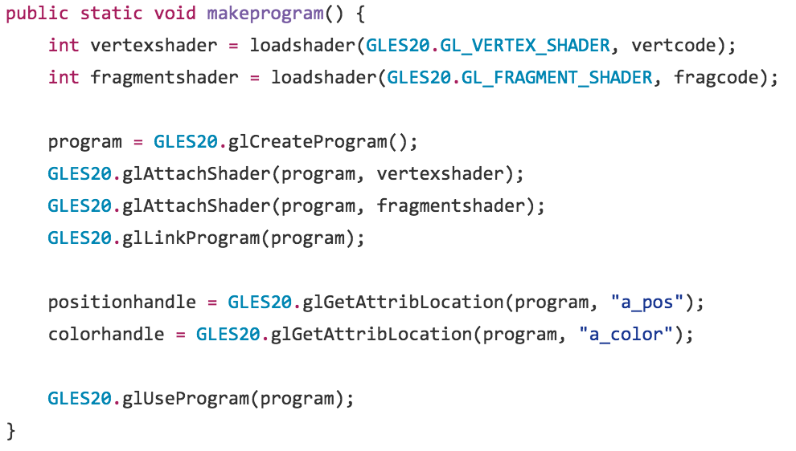
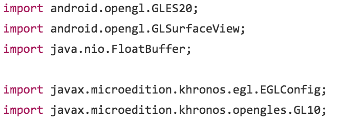
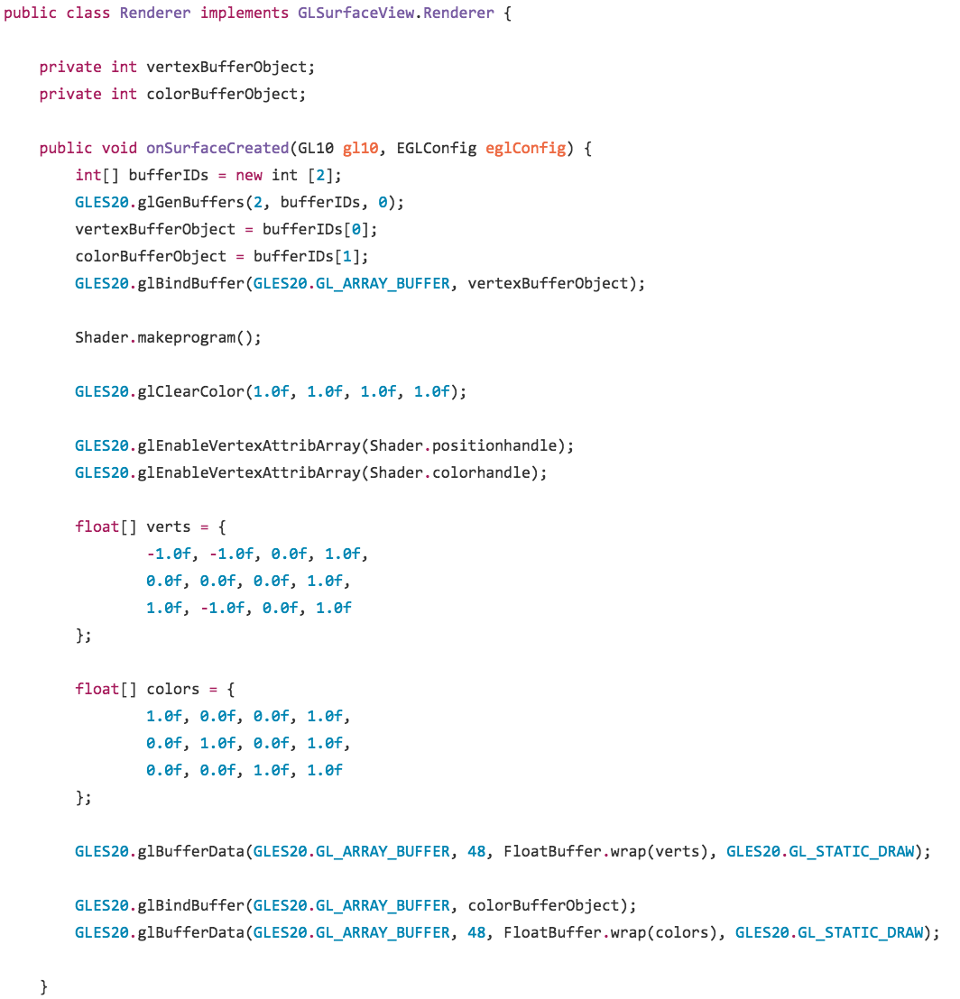
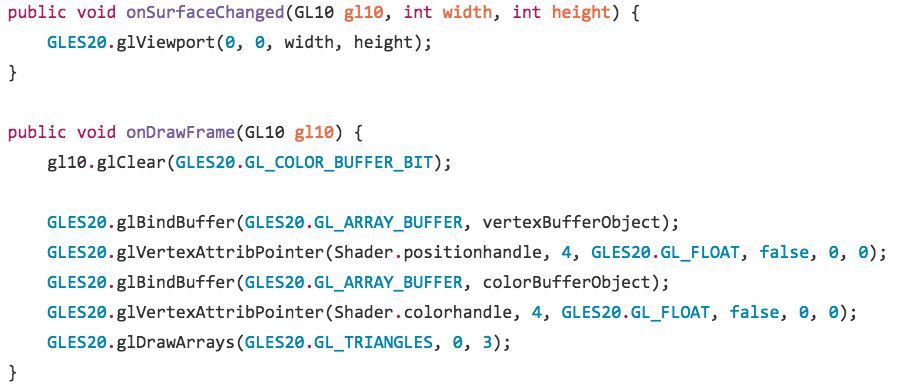

# Introduction to OpenGL and Graphics
###### Last updated: ShaneMasuda | Summer 2016
###### [Back to Index](../index.md)

### 0. Objective
This tutorial has two objectives. The first is to teach you a little bit about the graphics pipeline, as understanding the heirarchial structure and importance of the classes we write is necessary. The second is to familiarize you with some basic methods from the Open Graphics Library (OpenGL), the most commonly used library for rendering 2D and 3D graphics. Ultimately, we will be writing shader and renderer classes that will display a flat rainbow-colored triangle on the screen, but first we'll need a little background.

### 1. The Graphics Pipeline
The graphics pipeline consists of the sequence of steps necessary to create a 2D raster representation of a 3D scene. In other words, the steps necessary to transform a 3D scene into a rectangle of pixels. There are several steps in the graphics pipeline, but for something as straightforward as displaying a flat triangle, several of these steps can be bypassed. For now, we will only be concerned with the following steps, in order:

- Input Assembly: Assembles the inputs to the Vertex Shader from buffers.
- Vertex Shading: Vertices and their corresponding attributes are passed as inputs, manipulated, and output. This manipulation is entirely up to us, because we're writing the shaders!
- Primitive Assembly: Vertices are assembled into primatives.
- Rasterization: Rendering primatives are processed to fragments. Per fragment values are calculated by interpolation.
- Fragment Shading: Processes the fragments.

### 2. Creating Classes
As outlined in the simple app tutorial, let's create a blank activity, and add two new Java classes:
- Shader.java
- Renderer.java

In case you've forgotten:

The class names, as they should, describe exactly what these classes are going to contain. Let's start out with the shaders.

### 3. The Shader Class
First and foremost, we need to import our OpenGL library. For this project, we'll be using OpenGL ES 2.0 (in case you're curious, ES stands for Embedded Systems, computer systems with dedicated functions within a larger system). So under your package and at the top of your newly created Shader.java class, include the following statement:
> import android.opengl.GLES20;

This import statement will give us access to all of OpenGL ES 2.0's wonderful classes and methods. Begin by writing the class declaration, and declaring the following two Strings. Notice the names:

If you've guessed the purpose of these Strings already, you probably have a little bit of practice with Shaders. For the rest of you, these Strings represent our Vertex Shader and Fragment Shader code! While they look simple, let's notice something about the Vertex Shader code String named vertcode. The first three lines declare two attribute vec4s and a single varying vec4, named a_pos, a_color, and v_color respectively. vec4 stands for 4 dimensional vector, and is a datatype used in OpenGL. You can think of it simply as a four dimensional array holding the four values required to represent something, such as four coordinates representing the location of a vertex. The attribute keyword indicates a property that we'll want our vertices to have. The varying keyword represents a property that each fragment will have. I'll explain the varying part a bit later in the pipeline, but notice that our vertices have two attributes: one for position and one for color.

Now let's add a new method inside our Shader Class defintion called loadshader:

It takes in an int representing the shader type (differentiating Vertex and Fragment shaders), and a string for our shader code. While the method names we invoke from the GLES20 library explain what's going on, let's talk about it in a bit more detail. We're first calling glCreateShader on the type of shader that we want, which we'll use to create a new Vertex or Fragment Shader. We're then calling glShaderSource, and passing in our newly created shader and whichever shader code string we want. This is, like the name suggests, us supplying code that the shader will run whenever it's called. We then compile the shader with glCompileShader (which compiles the code we supplied) and return it, so that we can use it in the future.

The last method we'll add to our shader class is makeprogram. So add the following code to the Shader Class:

The first two lines call our loadshader method, create our Vertex and Fragment Shaders, and store them in the vertexshader and fragmentshader variables. The purpose of doing this is simple: When we create a program, we'll want to attach our shaders to the program so it can use them. This is exactly what the next four lines of the method do. We call glCreateProgram to create a new program, attach our two shaders, and link them to our program. The next two lines, which call glGetAttribLocation, simply retrieve the index at which the attributes for our vertices are in our shader code. In more advanced speak, we're pointing a buffer to the attributes we created earlier. The last line, as we expect, tells OpenGL to use our program for shading in the rendering class, which we'll make now.

### 4. The Renderer Class
Let's once again start out by importing what we'll need:

We already talked about the first one, but let's talk about the other important ones. android.opengl.GLSurfaceView is an interface containing all the methods we'll need for our renderer class. We'll talk about them one by one later. java.nio.FloatBuffer is super useful, as it allows us to turn an array of floats into a float buffer on the GPU. A Buffer is simply a block in memory that we use to store things, and it's important that the GPU has access to everything it needs in it's local memory, as it would be a pain and extremely inefficient to query the main memory of a computer for things during any sort of graphics rendering. 

So let's write our class definition, and override the first method from the interface we implement:

Our first two lines declare variables where we can store tags that reference buffers. This is for ease of reference, and follows from the importance of using buffers to preload information onto the GPU. From the names, we see that one buffer is for our vertices, and one is for our colors. 

The onSurfaceCreated method is called whenever a surface is created or recreated in OpenGL. Think of this surface as our canvas where we'll draw our beautiful triangle. The first four lines of our method create new tags to reference our buffers, and store them in our tag variables that we declared. The fifth line calls glBindBuffer, which simply connects the buffer where we'll be storing our vertex attributes to the tag we created; GL_ARRAY_BUFFER specifies that the purpose of this buffer is to hold vertex attributes. Notice what we're doing in the following lines: We're making our shaders, clearing the surface so that it's purely white, declaring arrrays holding the positions and colors of our three vertices (remember, we're making a triangle), and buffering our manually created data into our vertex and color buffers. Notice how we can only bind a single buffer at a time in order to load data into it; this is why the ordering of these method calls matters.

To finish off our renderer class, we simply need to override the final two methods from our interface. So create two new methods as follows:

onSurfaceChanged is called whenever the surface changes size. onDrawFrame is called when the frame is actually drawn, so we're simply supplying our attributes from our shader String code with the information we have in our buffers. Remember, this is done one buffer at a time.

### 5. Updating MainActivity
WE'RE BASICALLY DONE! Finally, just update main activity to do the following: Create a new surface with GLSurfaceView, set the client version of the surface using setEGLContextClientVersion, and give the surface the renderer we just created by passing our Renderer class to setRenderer. Run the app, and see what you get! 

When your rainbow triangle shows up, there's really only one more thing to talk about. Remember that varying that we declared in our Vertex Shader code earlier? That represents fragment properties, in our case color. We set the colors of the vertices to red, green, and blue, but where does the rainbow come from? The colors of the fragments are automatically interpolated! Essentially, the Fragment Shader notices that the vertices are different colors, and that the triangle connecting them must somehow go from being one color to another as you travel from one vertex to another. Thus, it infers, and automatically sets the color for you.

